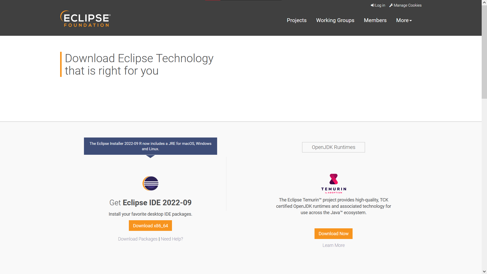

# Descargar IDE Eclipse
En esta sección procederemos a mostar como descargar el IDE de Eclipse, en caso de ya tener el instalador descargado, omitir este paso y proceder con el link[instalarEclipse.md]
1. Para descargar eclipse ingrese al enlace: [IDE Eclipse](https://www.eclipse.org/downloads/) y seleccione la opción que corresponda de su instalador.

../ImagesEclipse/img02.png)

```{image} ../ImagesEclipse/img02.png
:alt: fishy
:class: bg-primary mb-1
:width: 200px
:align: center
```

